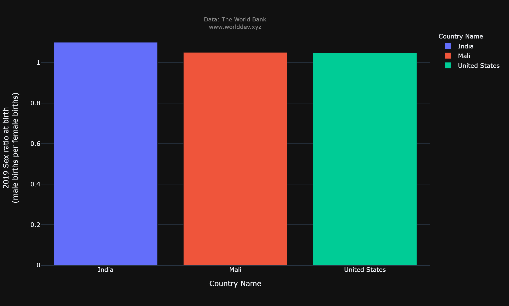
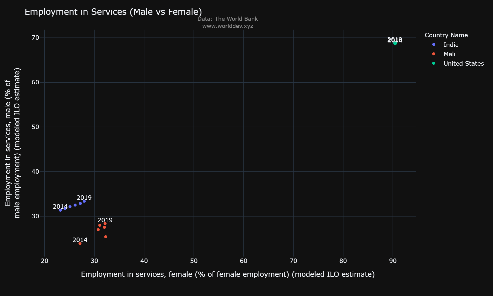
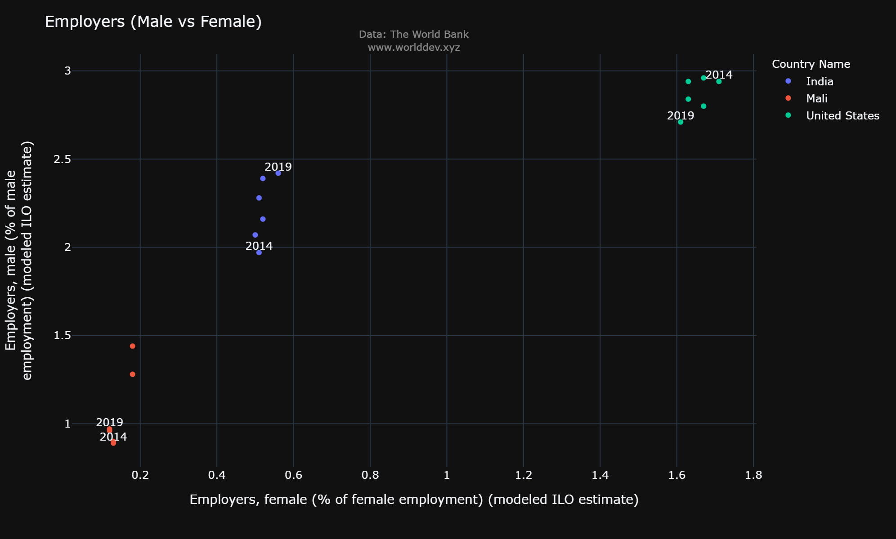
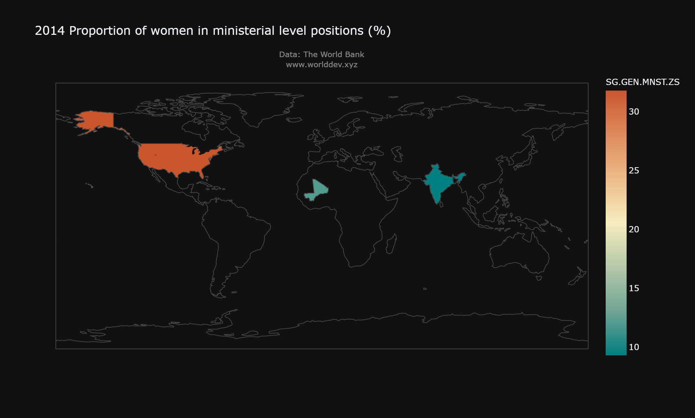
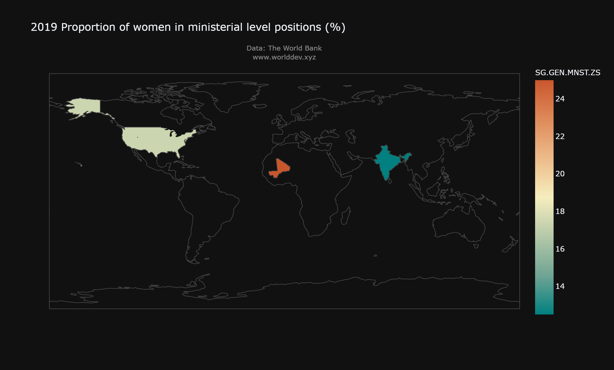

# **A Perspective On Gender Inequality From 2014 to 2019**

##### -Arushi Agarwal
###### March 19, 2022
---

### **Introduction**
The history of gender inequality has been there since ages. Although the developed countries have overcome such issues drastically in the past decades and started making improvements by instituting the policies which can safegaurd female rights. This article will focus on difference and progress made on gender issues. We will look at data for three types of countries: Developed [USA], Developing [India], Under-developed [Mali]. Although there are mutliple areas which can be brought under the lens in terms of gender inequality however, we will concentrate on paramaters such as Education, Sex-Ratio and Professional settings. 

### **Analysis and Strategy**
1. **Countries Under Scope:** We will look at data for three types of countries: Developed [USA], Developing [India], Under-developed [Mali].
2. **Data Source:** https://www.worlddev.xyz/
3. **Time Span:** 2014 - 2019
4. **Indicators:**
    - Sex Ratio
    - Education
    - Professional Settings (Employment, Employer, Politics)

### **Sex Ratio**

Even from the birth in developing and under-developing countries, there is an imbalance in the sex ratio. Looking at the past 5 years data [2014 – 2019], the number of males birth is higher in India and Mali as compared to United states. There are numerous reason which are leading to such higher sex-ratio at birth, namely, peference of male child over female, overall expenses of male vs female etc. As of 2019, India sex ratio at birth (male per female) is 1.1 and Mali is at 1.05 as compared to USA which has 1.047 as shown in the graph below.

With sex-ratio skewed towards male gender especially in India, there are serious repercussions. In some parts of India, males are not able to find girls for marriage which inturn leads to forced marriages and human trafficking. Numerous patriarchal factors suppliment such imbalance in developing and under-developed countries such as fear of dowry amongst parents from poor and lower middle class pivots their preference towards a male child and makes a girl child a burden. Similarly, a male child is consider as some one who will carry forward the family name as compared to a girl child who will get married and takes her husband's family name. Although India has banned sex-determination before birth, still many people use illegal resources to determine the sex of a child.

Looking closely in each of these three different socio-economic countries. We can easily see a significant trend in developing countries which are making progress by instituting a significant change in the work and social environment which are making awareness for female rights development. For example in the graph below which demonstrates the percentage of females out of total population in a span of 5 years is significantly seeing an uptrend (0.04%). However analyzing Mali (an under-developed country), we see a downward trend (0.1%) for percentage of females out of total population. Interestingly, we also see a downward trend (0.03%) in percentage of females out of total population in United States of America.

### **Education**

Even at the secondary education level, percentage of females in India (47.5%) and Mali (43.6%) are lower than United States (49.17%). It again representes a vast gap in gender ineuqality for basic education in developing and under-developed countries. This gap can be attributed to multiple socio-economic constraints. Developed countries like USA have many education policies which bolster female education. There are many scholarships and free education schemes which support the idea of female empowerment through education. Such policies help in reducing the gender gaps in female. There are many females joining engineering, and computer scinece courses as compared to past few decades.

Additonally, reviewing the gender parity index (GPI) for school enrollement at primary, secondary and tertiary level for 3 countries, we observed that at the primary level, India has the higher GPI than other 2 countries. This is an interesting observation at primary level as the school enrollment for female is higher because Government is providing free education at primary level. However, this trend drastically reduces at secondary level as many parents in rural areas don't prefer teenage girls to go outside for studies and generally believe that they will benefit more if they learn the household work. For under developed country, the GPI tremd is on the lower spectrum at all three levels which could be explained with poor government support and lower economy of that country.

At tertiary level, the developed country has higher Gender Parity Index due to availability of more scholarships and better education system. Due to this, an inflax of many international student communities can be seen in developed countries which includes higher number of females.

### **Professonial Setting**

Even after education inequalities faced throughtout the world by females, an educated females face numerous difficulties getting par with the males in the professional settings. Professonial setting could be an employment in public or private sector. As the education system for females is more supporting and less bias in the developed countries such as USA as compared to under-developed and developing countries, this can also be translated to professional settings. We can easily deduce from the graph below that in proffessional settings for instance service industry in developed country like USA has higher employement rate then India and Mali. There could be many factors for this like employers generally assume that males are competant than their female counterpart. Employer also believe that work efficiency is less in female as they focus more on household work and family. 

Similar patterns can also be observed once females are in line for promotions and they are generally sidelined because of aformentioned reasons. Additionally these inequalites are also reflected in their wages.

Female representation in political environment has seen a shift from 2014 to 2019 in developed and developing countries as per the graph below. In 2014, USA had highest proportion of women in ministerial level positions however it has reduced drastically in 2019. Gender stereotypes about the female politicians still detracts many women to get involved in it. As per general belief amongst voters, males are preferred over women as males can perform better in political positions. 

### **Conclusion**

As per the initial assessment in three diverse countries, acheiving gender equality requires a lot of efforts in least developed countries as they need proper infrastructure, information dissemination and resources. Developing country such as India is looking an upward trend as more females are getting opportunities to continue education at primary and secondary level. Additonally, more multinational companies are moving to developing countries and making changes in instituion by implementing gender equality policies.

In final assessment, it can be determined that developed countries have reduced the gender gap by introducing various schemes and policies in their system such as education, public and private job sectors. Similarly the same patterns are being followed by developing countries due to which they are seeing an upward trend in gender equality. However, there are many strong detracters which are stunting the growth and working against these positive trends. For Under Developed countries, institutionalization of government policies and mandates in all sectors of society will help in reducing this gender gap drastically. Additionally, awareness and elimination of years long believes could also support the growth of gender equality.

